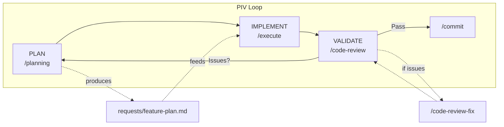
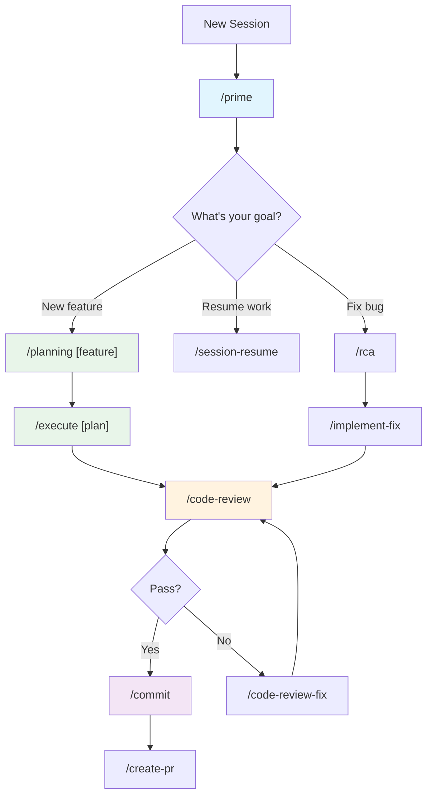
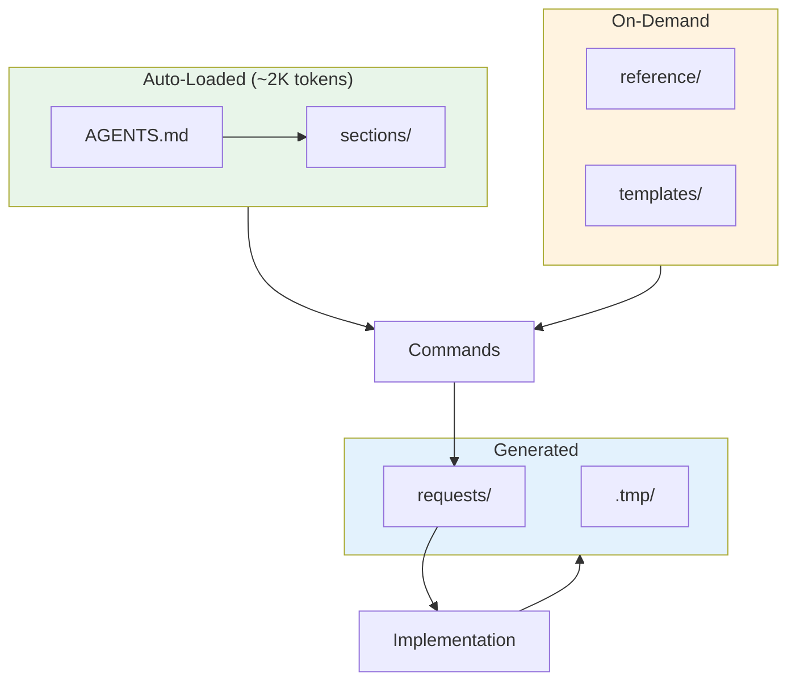

# My Coding System

**Turn AI into a reliable development partner.**

Stop babysitting AI through every implementation. My Coding System gives you structured workflows, intelligent context management, and built-in quality gates — so AI produces great code the first time.

Built for [OpenCode](https://opencode.ai) | Powered by the PIV Loop

---

## Why My Coding System?

**The Problem:** AI assistants are powerful but unreliable. They hallucinate APIs, miss edge cases, and produce code that "looks right" but breaks in production. Every session feels like starting from scratch.

**The Solution:** Give AI exactly the right context at the right time. My Coding System manages context automatically — auto-loaded rules for core workflows, on-demand guides for deep dives. The result: consistent, high-quality output without the guesswork.

**What You Get:**
- **Predictable AI behavior** — Context is loaded systematically, not randomly
- **Built-in quality gates** — Code review and validation catch issues before commit
- **Cross-session memory** — AI remembers decisions across conversations
- **Parallel workflows** — Work on multiple features simultaneously with git worktrees

---

## Quick Start

### Prerequisites
- [OpenCode CLI](https://opencode.ai) installed
- Git configured

### First Time?
Start with `/prime` to understand the system, then try `/planning` on a small feature.

### Setup

```bash
# 1. Clone this repo (or copy to your project)
git clone https://github.com/your-org/my-coding-system.git

# 2. Start a session — AI learns your codebase
/prime
# → Context loaded. Ready for planning | implementation | review.

# 3. Plan a feature — AI creates structured implementation guide
/planning Add user authentication with JWT
# → Creates requests/add-user-auth-jwt-plan.md (500+ lines of context)

# 4. Execute the plan — AI implements step-by-step
/execute requests/add-user-auth-jwt-plan.md
# → Implements tasks, validates each, reports progress

# 5. Commit your work
/commit
# → Git commit with conventional format + memory update
```

### What Happens Next

After your first feature:
- **Code review**: `/code-review` validates quality
- **Fix issues**: `/code-review-fix` addresses findings
- **Create PR**: `/create-pr` opens pull request
- **Parallel work**: `/new-worktree` starts a parallel feature branch

---

## The PIV Loop

The PIV Loop is the core workflow: **Plan**, **Implement**, **Validate**, then iterate.



- **Plan**: Vibe planning conversation into a structured plan document (500-700 lines of context-rich implementation instructions)
- **Implement**: Execute the plan task-by-task in a fresh conversation (clean context = better output)
- **Validate**: Code review, testing, and human review. Issues loop back to Plan.

---

## Commands

### Essential Workflow

These 5 commands cover 90% of daily development:

| Command | Description | When to Use |
|---------|-------------|-------------|
| `/prime` | Quick codebase handshake (~8K tokens) | Start of every session |
| `/planning [feature]` | Create implementation plan | Before building any feature |
| `/execute [plan]` | Implement from plan file | After planning |
| `/code-review` | Technical quality review | After implementation |
| `/commit` | Git commit with conventional format | After validation |

### Advanced Operations

| Command | Description | When to Use |
|---------|-------------|-------------|
| `/code-review-fix` | Fix review findings | After code review |
| `/end-to-end-feature` | Full autonomous pipeline | Trusted, simple features |
| `/session-resume` | Resume interrupted work | After paused execution |
| `/new-worktree` | Create parallel branch | Multi-feature work |
| `/parallel-e2e` | Parallel multi-feature | Advanced parallel builds |
| `/merge-worktrees` | Merge completed worktrees | After parallel work |
| `/tmux-worktrees` | tmux session with worktrees | Parallel terminal work |
| `/create-agent` | Generate new agent definition | Adding specialized agents |
| `/activate-agents` | Enable example agents | Activating dormant agents |
| `/create-pr` | Open pull request | After commit |
| `/create-prd` | Create product requirements doc | New features |
| `/rca` | Root cause analysis | Debugging |
| `/implement-fix` | Implement fix from RCA | After RCA |
| `/system-review` | Audit system alignment | Quarterly maintenance |
| `/execution-report` | Generate execution summary | After /execute |
| `/setup-github-automation` | Configure CI/CD automation | Project setup |
| `/init-c` | Generate AGENTS.md for new project | New projects |

---

## Which Command Should I Use?



---

## Architecture



| Tier | Purpose | Token Cost |
|------|---------|------------|
| **Auto-loaded** | Core rules always available | ~2K |
| **On-demand** | Deep guides when needed | ~89K available |
| **Generated** | Plans, state, session context | Variable |

---

## Project Structure

```
My-Coding-System/
├── AGENTS.md              # Auto-loaded rules (~2K tokens)
├── memory.md              # Cross-session memory
├── sections/              # Core rule sections (6 files)
├── reference/             # Deep guides (22 files)
├── templates/             # Reusable templates (24 files)
├── requests/              # Feature plans (per PIV loop)
├── .tmp/                  # Runtime state (gitignored)
├── .opencode/commands/    # Commands (22 files)
└── .opencode/agents/      # Agents (24 active + 8 examples)
```

---

## Core Principles

- **YAGNI** — Only implement what's needed right now
- **KISS** — Prefer simple, readable solutions over clever abstractions
- **DRY** — Extract common patterns, but don't over-abstract
- **Limit AI Assumptions** — Be explicit in plans and prompts
- **Always Be Priming (ABP)** — Start every session with `/prime`. Context is everything.

---

## On-Demand Guides

| Guide | Load when... |
|-------|-------------|
| `reference/layer1-guide.md` | Setting up AGENTS.md for a new project |
| `reference/validation-pyramid.md` | Understanding 5-level validation hierarchy |
| `reference/validation-strategy.md` | Planning or running validation |
| `reference/file-structure.md` | Looking up where files belong |
| `reference/command-design-overview.md` | Designing or modifying slash commands |
| `reference/github-integration.md` | Setting up GitHub Actions or CodeRabbit |
| `reference/remote-system-overview.md` | Deploying or using the remote coding agent |
| `reference/mcp-skills-overview.md` | Configuring MCP servers or creating skills |
| `reference/subagents-overview.md` | Creating or debugging subagents |
| `reference/archon-workflow.md` | Using Archon task management or RAG search |
| `reference/git-worktrees-overview.md` | Parallel feature implementation with worktrees |

---

## Token Budget

| Context Type | Tokens | When Loaded |
|--------------|--------|-------------|
| Auto-loaded | ~2K | Every session |
| `/prime` | ~8K | Session start |
| Commands | 0.5-2.2K | When invoked |
| Reference guides | ~89K total | On-demand only |

> **Design principle**: Prime is a handshake, not a deep dive. Load specific reference guides only when needed.
