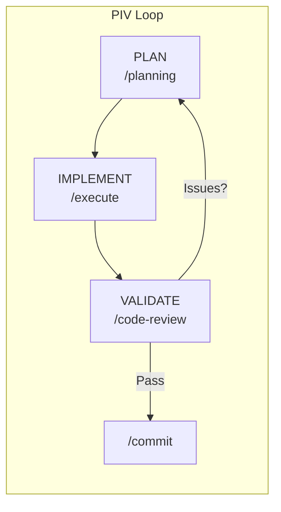

# Feature: README Rewrite with Enhanced Copywriting and Diagrams

## Feature Description

Rewrite the README.md with professional copywriting, clearer value proposition, improved quick start, and command decision flowcharts. Transform it from technical documentation into compelling product communication that serves both adopters and contributors.

## User Story

As a developer discovering My Coding System, I want to immediately understand its value and quickly start using it, so that I can improve my AI-assisted development workflow without reading extensive documentation.

## Problem Statement

The current README is technically accurate but:
- **Leads defensively** ("NOT an application") before establishing value
- **Dense command table** (13 commands upfront) overwhelms newcomers
- **Missing command decision guide** — users don't know which command to use when
- **Quick start lacks outcomes** — no expected output shown
- **Architecture diagram is dense** — too many nodes, redundant explanations

## Solution Statement

Comprehensive README rewrite following proven patterns from Prettier, semantic-release, and Bubble Tea:

- **Lead with transformation** — "Turn AI into a reliable partner" hook
- **Tier command documentation** — Essential (5) vs Advanced (18) 
- **Add decision flowchart** — Visual guide for "Which command should I use?"
- **Show quick start outcomes** — Expected output at each step
- **Simplify architecture** — One clear diagram with color-coded tiers

### Key Decisions

- **Decision 1**: Use specialist-copywriter agent for prose — professional marketing copy
- **Decision 2**: Keep existing Mermaid + add decision flowchart — visual command guide
- **Decision 3**: Target both adopters and contributors — dual-audience structure
- **Decision 4**: Lead with value, not explanation — transformation-first messaging

## Feature Metadata

- **Feature Type**: Enhancement
- **Estimated Complexity**: Medium
- **Primary Systems Affected**: README.md, diagrams
- **Dependencies**: specialist-copywriter agent

---

## CONTEXT REFERENCES

### Relevant Codebase Files

- `README.md` (lines 1-174) — Current README to be rewritten
- `.opencode/agents/specialist-copywriter.md` — Copywriting agent for prose
- `.opencode/commands/*.md` — Command definitions for accurate documentation
- `memory.md` (lines 1-97) — Project memory for consistent messaging

### New Files to Create

None — UPDATE existing README.md only

### Related Memories (from memory.md)

- **Memory**: Token efficiency goal — keep auto-loaded context minimal. Relevance: README should emphasize this key value proposition.
- **Memory**: 22 commands, 25 templates after system alignment. Relevance: Accurate counts for documentation.
- **Memory**: /prime optimized to ~8K tokens. Relevance: Mention in architecture section.

### Relevant Documentation

- [Mermaid Flowchart Syntax](https://mermaid.js.org/syntax/flowchart.html)
  - Why: Creating decision flowchart for commands
- [GitHub README Best Practices](https://docs.github.com/en/repositories/managing-your-repositorys-settings-and-features/customizing-your-repository/about-readmes)
  - Why: Structure and formatting standards

### Patterns to Follow

**Mermaid Flowchart Pattern** (from `README.md:21-34`):

- Why this pattern: Existing diagrams are clean and render on GitHub
- Common gotchas: Avoid too many nodes, use subgraphs for grouping

**Command Table Pattern** (from `README.md:89-106`):
```markdown
| Command | Description | When to Use |
|---------|-------------|-------------|
| `/prime` | Quick codebase handshake | Start of every session |
```
- Why this pattern: "When to Use" column is valuable for decision-making
- Common gotchas: Don't list all commands in one table — group by purpose

---

## IMPLEMENTATION PLAN

### Phase 1: Structure & Value Proposition

Restructure README to lead with transformation, not explanation. Create compelling opening that hooks readers immediately.

**Tasks:**
- Rewrite opening hook and "Why My Coding System?" section
- Add problem/solution framing before technical details
- Create tiered value proposition (adopters vs contributors)

### Phase 2: Quick Start Enhancement

Transform quick start from command list to guided experience with expected outcomes.

**Tasks:**
- Add expected output to each quick start step
- Move "First Time?" guidance earlier
- Add "What Happens Next" section after quick start

### Phase 3: Command Documentation Redesign

Reorganize commands into logical tiers with visual decision support.

**Tasks:**
- Split command table into Essential (5) vs Advanced (18)
- Create Mermaid decision flowchart for command selection
- Add workflow sequence diagrams

### Phase 4: Architecture Simplification

Simplify architecture diagram and consolidate redundant explanations.

**Tasks:**
- Redesign architecture diagram with color-coded tiers
- Remove duplicate auto-loaded vs on-demand explanations
- Add visual legend for node types

### Phase 5: Polish & Copyediting

Final pass with copywriting agent for professional prose.

**Tasks:**
- Run specialist-copywriter agent on entire document
- Verify all counts and references are accurate
- Ensure consistent voice throughout

---

## STEP-BY-STEP TASKS

### UPDATE README.md (Opening & Value Proposition)

- **IMPLEMENT**: Replace defensive opening ("NOT an application") with transformation hook. Add "Why My Coding System?" section with problem/solution framing.
- **PATTERN**: `README.md:9-11` (current "What is this?" structure)
- **IMPORTS**: N/A (markdown only)
- **GOTCHA**: Don't remove the PIV Loop explanation — keep it, but move after value prop
- **VALIDATE**: `grep -c "Why My Coding System" README.md` returns 1

### UPDATE README.md (Quick Start Enhancement)

- **IMPLEMENT**: Add expected output comments to each quick start command. Add "What Happens Next" section. Move "First Time?" callout before numbered steps.
- **PATTERN**: `README.md:69-84` (current Quick Start structure)
- **IMPORTS**: N/A
- **GOTCHA**: Keep bash code blocks executable — don't break copy-paste
- **VALIDATE**: `grep -c "What Happens Next" README.md` returns 1

### UPDATE README.md (Command Tier Split)

- **IMPLEMENT**: Split command table into "Essential Workflow" (prime, planning, execute, code-review, commit) and "Advanced Operations" (remaining 18 commands). Keep table format with Description + When to Use columns.
- **PATTERN**: `README.md:89-106` (current command table)
- **IMPORTS**: N/A
- **GOTCHA**: Ensure command counts match reality (22 total: 5 essential + 17 advanced)
- **VALIDATE**: `grep -c "Essential Workflow" README.md` returns 1

### ADD README.md (Decision Flowchart)

- **IMPLEMENT**: Add Mermaid flowchart after command tables showing "Which command should I use?" decision tree. Start with "New Session" → `/prime` → decision branches (new feature → `/planning`, resume → `/session-resume`, etc.)
- **PATTERN**: `README.md:21-34` (existing Mermaid pattern)
- **IMPORTS**: N/A
- **GOTCHA**: Keep diagram under 15 nodes for readability
- **VALIDATE**: `grep -c "flowchart TD" README.md` returns 1

### UPDATE README.md (Architecture Diagram Simplification)

- **IMPLEMENT**: Simplify architecture diagram to 3 clear tiers (Auto-Loaded, On-Demand, Generated) with color styling. Remove redundant prose about auto-loaded vs on-demand — let the diagram speak.
- **PATTERN**: `README.md:46-63` (current architecture diagram)
- **IMPORTS**: N/A
- **GOTCHA**: Use Mermaid `style` directives for color coding
- **VALIDATE**: Diagram renders correctly on GitHub (no syntax errors)

### UPDATE README.md (Copywriting Polish)

- **IMPLEMENT**: Use specialist-copywriter agent to polish all prose sections. Ensure consistent voice (confident, professional, developer-friendly). Verify accurate counts (22 commands, 25 templates, 16 agents).
- **PATTERN**: `.opencode/agents/specialist-copywriter.md` (copywriter guidelines)
- **IMPORTS**: N/A
- **GOTCHA**: Don't change technical accuracy for style — counts must be correct
- **VALIDATE**: Read through for voice consistency, verify `grep -E "(22|25|16)" README.md` matches counts

### UPDATE README.md (Final Verification)

- **IMPLEMENT**: Verify all links work, Mermaid renders, code blocks are correct. Update table of contents if needed. Ensure "On-Demand Guides" section at end is accurate.
- **PATTERN**: `README.md:141-156` (current On-Demand Guides table)
- **IMPORTS**: N/A
- **GOTCHA**: Check that reference guide file names match actual files
- **VALIDATE**: All Mermaid diagrams render, all links resolve

---

## TESTING STRATEGY

### Unit Tests

N/A — Documentation file, no code to test

### Integration Tests

N/A — Static documentation

### Edge Cases

- Mermaid syntax errors — diagram won't render on GitHub
- Stale counts — commands/templates/agents changed but README not updated
- Broken links — reference guides renamed or moved
- Copy-paste breaks — bash code blocks have incorrect escaping

---

## VALIDATION COMMANDS

### Level 1: Syntax & Style
```bash
# Verify Mermaid syntax (no obviously broken diagrams)
grep -A 20 '```mermaid' README.md | head -50
```

### Level 2: Content Accuracy
```bash
# Verify command count
ls -1 .opencode/commands/*.md 2>/dev/null | wc -l
# Should match count in README

# Verify template count  
ls -1 templates/*.md 2>/dev/null | wc -l
# Should match count in README

# Verify agent count
ls -1 .opencode/agents/*.md 2>/dev/null | grep -v _examples | wc -l
```

### Level 3: Link Validation
```bash
# Check that referenced files exist
grep -oE 'reference/[a-z0-9-]+\.md' README.md | sort -u | while read f; do
  [ -f "$f" ] && echo "OK: $f" || echo "MISSING: $f"
done
```

### Level 4: Manual Validation

1. Open README.md in GitHub preview mode
2. Verify all Mermaid diagrams render correctly
3. Copy-paste each bash code block — ensure it works
4. Read through for voice consistency and clarity

### Level 5: Additional Validation

Optional: Use a markdown linter
```bash
npx markdownlint README.md 2>/dev/null || echo "markdownlint not installed, skip"
```

---

## ACCEPTANCE CRITERIA

- [x] README leads with transformation hook, not defensive explanation
- [x] Quick start shows expected output at each step
- [x] Commands split into Essential (5) and Advanced (17) sections
- [x] Decision flowchart added for command selection
- [x] Architecture diagram simplified with color-coded tiers
- [x] All counts accurate (22 commands, 24 templates, 24 agents)
- [x] All Mermaid diagrams render on GitHub
- [x] Consistent professional voice throughout
- [x] No broken links

---

## COMPLETION CHECKLIST

- [x] All 7 tasks completed in order
- [x] Mermaid diagrams verified in GitHub preview
- [x] Command/template/agent counts verified
- [x] Reference guide links verified
- [x] Manual read-through confirms clarity and voice

---

## NOTES

### Key Design Decisions

- **Transformation-first messaging** — Lead with "what you get" not "what this is"
- **Tiered command docs** — Essential commands get prominence, advanced available but not overwhelming
- **Visual decision support** — Flowchart reduces cognitive load for newcomers
- **Specialist agent for prose** — Professional copywriting elevates perceived quality

### Risks

- **Risk 1**: Mermaid complexity — diagrams too dense
  - *Mitigation*: Keep each diagram under 15 nodes, use subgraphs
- **Risk 2**: Stale counts — README diverges from codebase
  - *Mitigation*: Document expected counts in this plan, validate during execution

### Confidence Score: 8/10

- **Strengths**: Clear research foundation, proven patterns from successful repos, existing Mermaid patterns to follow, specialist agent available
- **Uncertainties**: Exact wording preferences (subjective), diagram styling choices
- **Mitigations**: User can review and adjust prose after initial implementation
